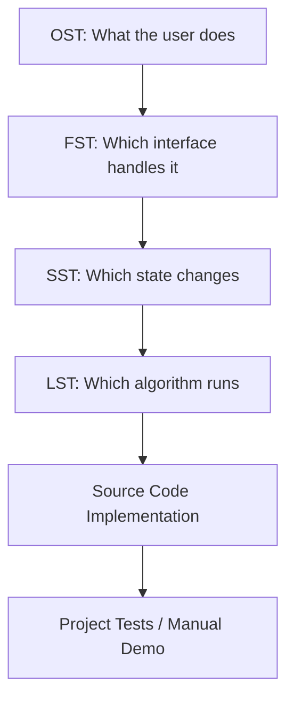
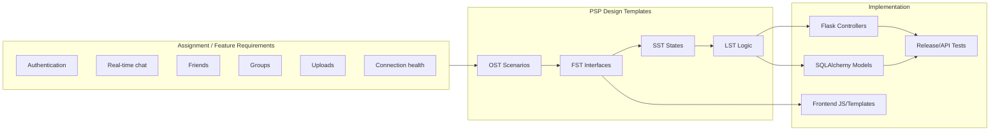
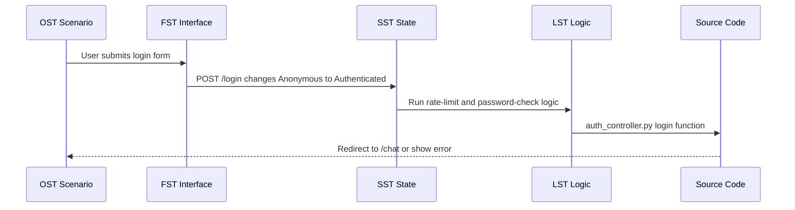
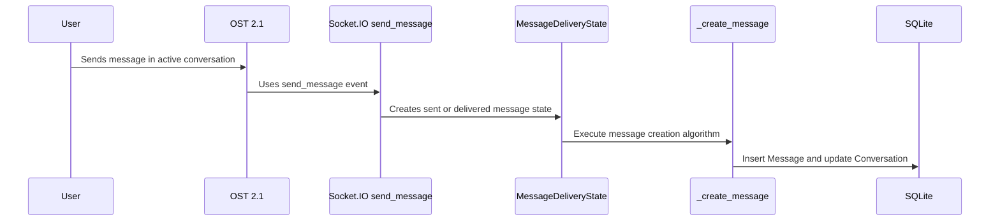

# PSP Mapping README

This file maps the Personal Software Process (PSP) design templates to this chat project. The PSP templates describe the same system from four different views: user operations, external interfaces, state machines, and internal logic.

## PSP Template Files

| PSP Template | File | Main Purpose |
|--------------|------|--------------|
| OST - Operational Specification Template | `project_support/docs/psp/OST_Operational_Specification_Template.md` | Describes user actions, system responses, scenarios, exceptions, and test cases |
| FST - Functional Specification Template | `project_support/docs/psp/FST_Functional_Specification_Template.md` | Describes routes, classes, modules, method contracts, parameters, returns, and external APIs |
| SST - State Specification Template | `project_support/docs/psp/SST_State_Specification_Template.md` | Describes states and transitions for sessions, messages, friend requests, groups, and connections |
| LST - Logic Specification Template | `project_support/docs/psp/LST_Logic_Specification_Template.md` | Describes internal algorithms and pseudocode for key procedures |
| PSP Index | `project_support/docs/psp/PSP_Templates_Index.md` | Summarizes the PSP folder and recommended reading order |

## How PSP Views Connect



Example: sending a message starts as an OST scenario, maps to FST Socket.IO/REST interfaces, changes SST message delivery state, and is implemented by LST message creation logic.

## Module to PSP Mapping

| Project Module | User Scenario View (OST) | Interface View (FST) | State View (SST) | Logic View (LST) | Main Source Files |
|----------------|--------------------------|----------------------|------------------|------------------|-------------------|
| Authentication | Login, register, logout | `User`, `/login`, `/register`, `/logout`, CSRF helpers | `UserSessionState`, login rate-limited state | Login throttle and password verification | `backend/controllers/auth_controller.py`, `backend/models/user.py`, `frontend/templates/login.html`, `frontend/templates/register.html` |
| Messaging | Send text, send attachment, search, read receipts | `Conversation`, `Message`, `Attachment`, chat REST routes, Socket.IO events | `MessageDeliveryState` | `_create_message`, `_mark_conversation_read`, `socket_connect` | `backend/controllers/chat_controller.py`, `backend/models/message.py`, `frontend/static/js/chat.js` |
| Friends | Search users, send request, accept/reject, remove friend | Friend REST API, `Friend`, `FriendRequest`, `are_friends` | `FriendRequestState` | `send_friend_request`, `add_friendship` | `backend/controllers/friends_controller.py`, `backend/models/user.py` |
| Groups | Create group, view members, add/remove/leave group | Group REST API, `Group`, `GroupMember` | `GroupMembershipState` | Group creation and membership validation | `backend/controllers/chat_controller.py`, `backend/models/group.py` |
| Connection Health | Startup health, outage, recovery, socket reconnect | `/health`, `ConnectionManager`, Socket.IO lifecycle | `BackendHealthState`, `SocketConnectionState`, `UserPresenceState` | `checkHealth`, `socket_connect`, delivery update on reconnect | `backend/app.py`, `frontend/static/js/connection.js`, `backend/controllers/chat_controller.py` |
| Profile | Edit display name, bio, avatar | Profile routes and upload helpers | Profile data is part of authenticated user state | Avatar upload validation and save flow | `backend/controllers/profile_controller.py`, `backend/controllers/helpers.py`, `backend/models/user.py` |

## PSP Traceability Diagram



## PSP Mapping by File

| Source File | PSP Template Use |
|-------------|------------------|
| `backend/app.py` | FST for app routes and `/health`; SST for backend/database health; OST for startup and health-check behavior |
| `backend/config.py` | FST for configuration variables; OST for deployment/runtime assumptions |
| `backend/controllers/auth_controller.py` | OST authentication scenarios; FST auth route contracts; SST session/rate-limit states; LST login throttle pseudocode |
| `backend/controllers/chat_controller.py` | OST messaging/group scenarios; FST REST and Socket.IO interfaces; SST message/group/presence states; LST message/read/socket algorithms |
| `backend/controllers/friends_controller.py` | OST friend management scenarios; FST friend endpoints; SST friend request state; LST request validation logic |
| `backend/controllers/profile_controller.py` | OST profile operations; FST profile route contracts; upload validation support |
| `backend/controllers/helpers.py` | FST helper APIs for CSRF, sanitizing, login guards, upload checks |
| `backend/models/user.py` | FST model interfaces; SST user/session/friend request state |
| `backend/models/message.py` | FST message/conversation/attachment entities; SST message delivery state |
| `backend/models/group.py` | FST group/member entities; SST group membership state |
| `frontend/static/js/chat.js` | OST user interaction behavior; FST client API use; SST client-side chat state |
| `frontend/static/js/connection.js` | OST connection scenarios; FST `ConnectionManager`; SST backend/socket connection state; LST health polling algorithm |
| `frontend/static/js/auth.js` | OST login/register form interaction; FST frontend validation support |
| `project_support/tests/*.py` | Verifies selected OST scenarios and FST API contracts |

## Cross-Template Example: User Login



PSP mapping:

- OST: Scenario 1.1 - User Login.
- FST: `login` route, `User.check_password`, session and CSRF helpers.
- SST: `UserSessionState`.
- LST: login rate limiting and credential validation.
- Code: `backend/controllers/auth_controller.py`.

## Cross-Template Example: Sending a Chat Message



PSP mapping:

- OST: Scenario 2.1 - Send Text Message.
- FST: `send_message` Socket.IO event, `Message` model, `message:new` event.
- SST: `MessageDeliveryState`.
- LST: `_create_message`, `_mark_conversation_read`, `socket_connect`.
- Code: `backend/controllers/chat_controller.py`, `backend/models/message.py`, `frontend/static/js/chat.js`.

## Cross-Template Example: Friend Request

```mermaid
stateDiagram-v2
    [*] --> "OST: Search user"
    "OST: Search user" --> "FST: POST /api/friends/request"
    "FST: POST /api/friends/request" --> "SST: pending"
    "SST: pending" --> "LST: validate duplicate/self/friend"
    "LST: validate duplicate/self/friend" --> "Code: FriendRequest row"
    "Code: FriendRequest row" --> "SST: accepted"
    "Code: FriendRequest row" --> "SST: rejected"
```

PSP mapping:

- OST: Scenario 3.1 - Search Users and Send Friend Request.
- FST: friends REST API and `FriendRequest`.
- SST: `FriendRequestState`.
- LST: `send_friend_request`, `add_friendship`.
- Code: `backend/controllers/friends_controller.py`.

## Recommended PSP Reading Order

1. Read `OST_Operational_Specification_Template.md` to understand the user-visible behavior.
2. Read `FST_Functional_Specification_Template.md` to connect behavior to routes, events, classes, and modules.
3. Read `SST_State_Specification_Template.md` to understand lifecycle changes such as login, message status, friend request status, and connection status.
4. Read `LST_Logic_Specification_Template.md` to understand internal algorithms before editing code.
5. Use this `PSP_README.md` as the traceability map between templates and source files.

## How to Extend PSP Documentation

When a new feature is added:

1. Add or update an OST scenario that describes the user action.
2. Add or update FST entries for any new route, event, model method, or frontend API.
3. Add an SST state machine if the feature has statuses or lifecycle transitions.
4. Add LST pseudocode for validation, processing, or algorithms that are not trivial.
5. Link the new source files and tests in this mapping file.

## Summary

The PSP templates are not separate from the code. They describe the project from planning to implementation:

- OST explains how users operate the system.
- FST explains what interfaces the system exposes.
- SST explains how system states change.
- LST explains how important procedures work internally.

Together, they provide a design map for the Flask backend, JavaScript frontend, SQLAlchemy database models, Socket.IO communication, and test coverage.
