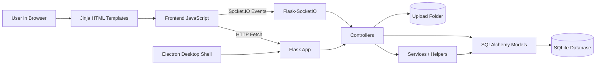
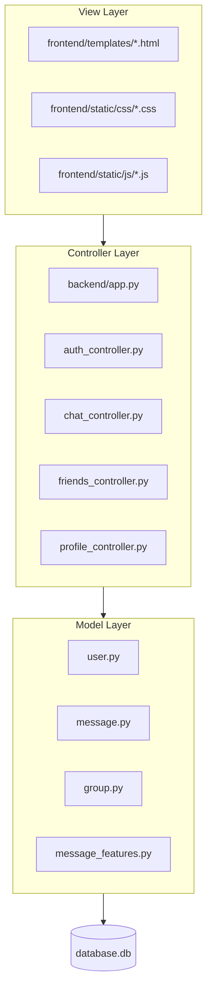
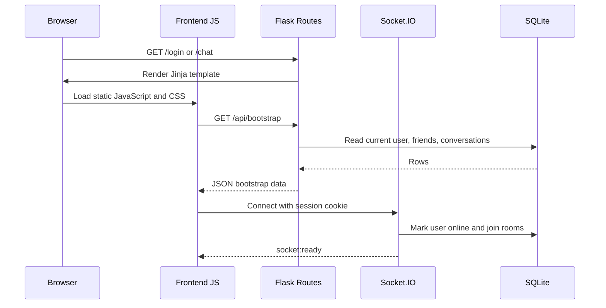
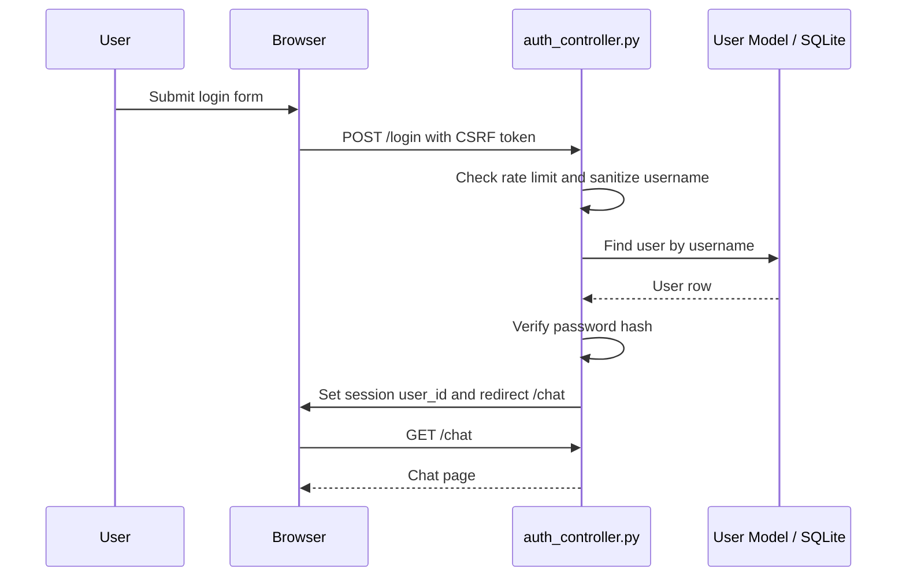
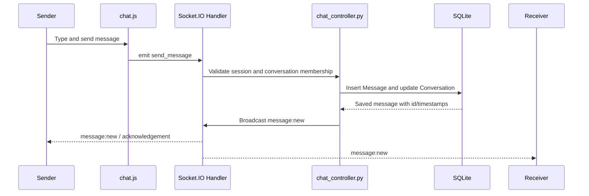
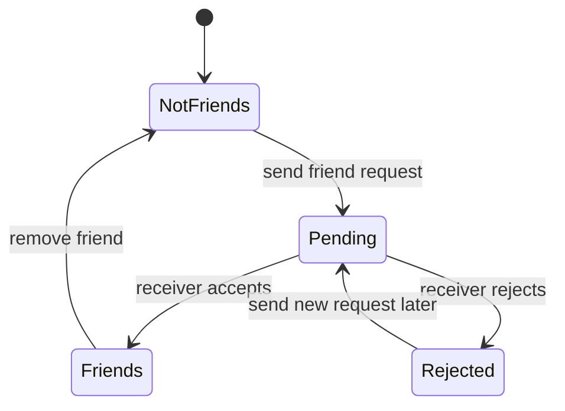
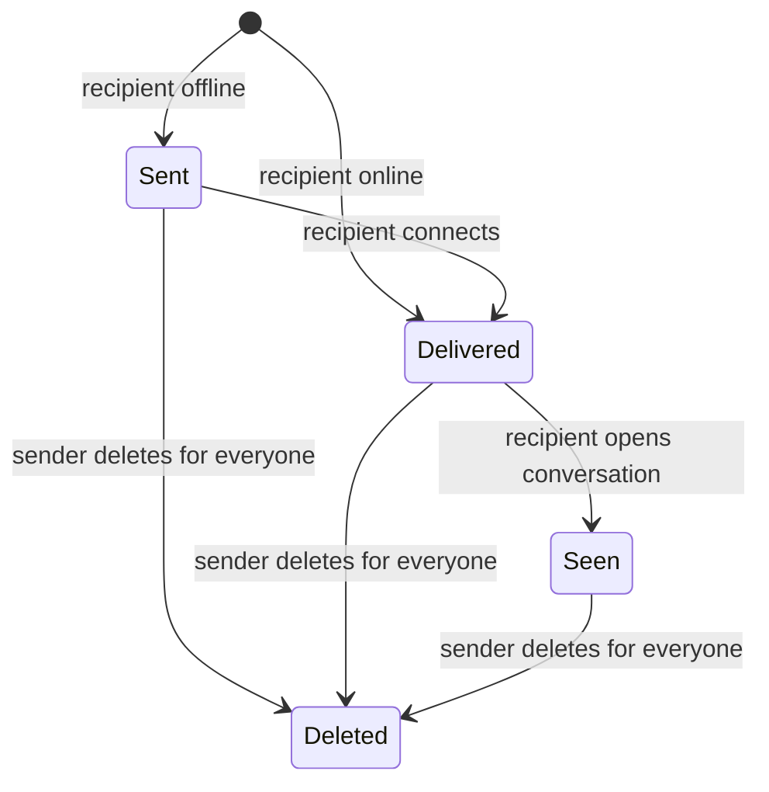
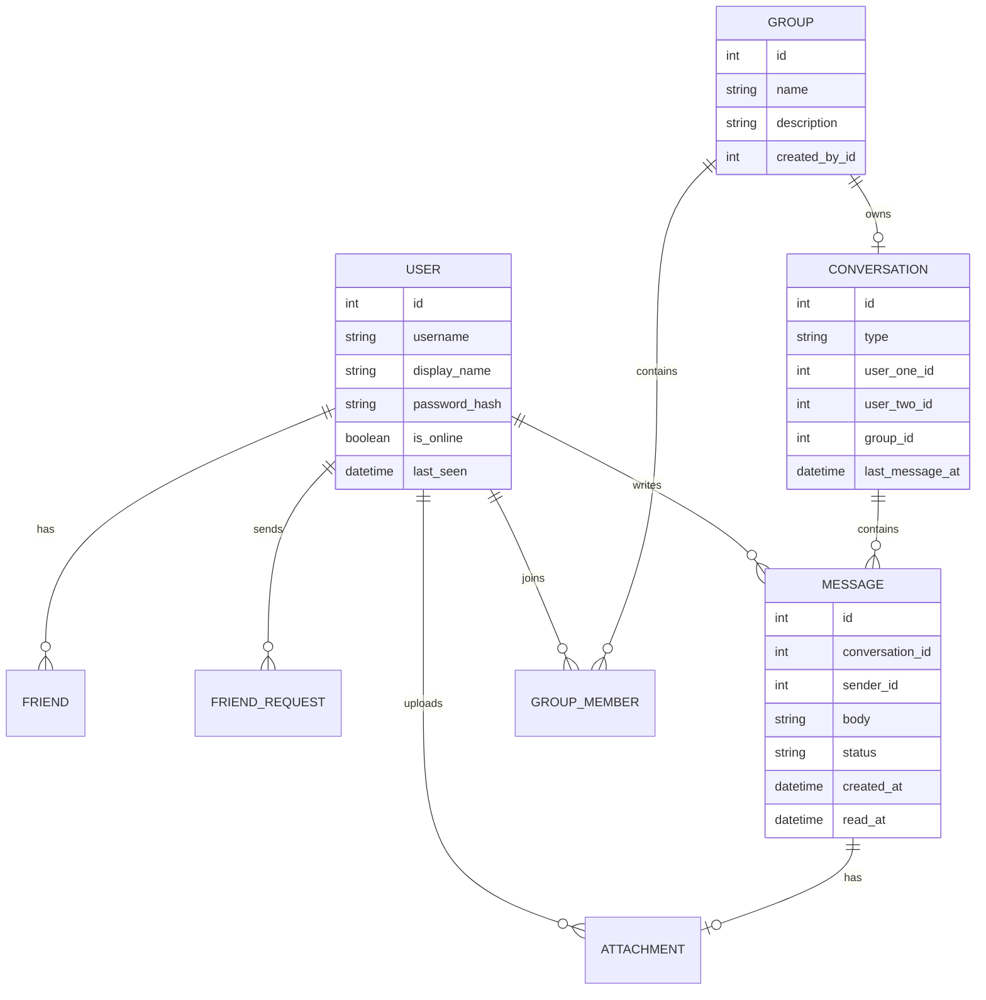

# WeChat-Inspired Chat Clone

This project is a full-stack real-time messaging application inspired by common chat app workflows. It includes account registration, login, friends, direct messages, group chats, attachments, delivery/read status, typing indicators, profile updates, dark mode, and a desktop wrapper.

The project is implemented as a Flask web application with Jinja templates, vanilla JavaScript, SQLAlchemy models, SQLite storage, and Socket.IO for real-time communication.

## Main Features

- User registration, login, logout, sessions, CSRF protection, and hashed passwords.
- User profiles with display name, bio, avatar, online status, and last seen.
- User search, friend requests, accept/reject flow, friend list, and friend removal.
- One-to-one messaging with delivery status, seen receipts, typing indicators, unread counts, and message history.
- Group creation, group member management, group info drawer, and group messaging.
- Image/document upload, preview, and secure attachment download.
- Message search, reactions, pinning, forwarding, edit/delete, emoji picker, notifications, and dark mode.
- Health endpoint and frontend connection monitor for backend/database/realtime status.
- Optional Electron desktop shell that starts the same Flask app locally.

## Technology Stack

| Layer | Technology |
|-------|------------|
| Backend | Flask, Flask Blueprints |
| Realtime | Flask-SocketIO |
| Database | SQLite with SQLAlchemy ORM |
| Frontend | Jinja HTML templates, vanilla JavaScript, CSS |
| Auth/Security | Flask sessions, CSRF token checks, Werkzeug password hashing |
| Desktop | Electron wrapper |
| Deployment | Gunicorn, Procfile, Render blueprint config |

## Project Structure

```text
scd-ass/
|-- backend/
|   |-- app.py                      # Flask app factory, routes, health check, startup
|   |-- config.py                   # App configuration, database paths, upload paths
|   |-- extensions.py               # SQLAlchemy and Socket.IO extension objects
|   |-- seed.py                     # Demo users, friends, conversations, messages
|   |-- schema.sql                  # Reference SQLite schema
|   |-- controllers/
|   |   |-- auth_controller.py       # Login, register, logout
|   |   |-- chat_controller.py       # Chat APIs, group APIs, Socket.IO events
|   |   |-- friends_controller.py    # Search users, friend requests, friends list
|   |   |-- profile_controller.py    # Profile/avatar updates
|   |   `-- helpers.py              # CSRF, sanitizing, uploads, auth guards
|   |-- models/
|   |   |-- user.py                  # User, Friend, FriendRequest
|   |   |-- message.py               # Conversation, Message, Attachment
|   |   |-- group.py                 # Group, GroupMember
|   |   `-- message_features.py      # Hidden messages, reactions, pinned messages
|   `-- services/
|       |-- conversation_service.py  # Conversation helper logic
|       `-- message_service.py       # Message helper logic
|-- frontend/
|   |-- templates/                  # Jinja pages: login, register, chat, profile
|   `-- static/
|       |-- css/                    # App styling and responsive fixes
|       |-- js/                     # Chat, auth, connection, utility scripts
|       `-- vendor/                 # Socket.IO browser client
|-- desktop/                        # Electron desktop shell
|-- project_support/
|   |-- docs/psp/                  # PSP design templates
|   |-- tests/                     # Release/API tests
|   `-- scripts/                   # Build and release scripts
|-- Procfile                        # Production start command
|-- render.yaml                     # Render deployment blueprint
|-- runtime.txt                     # Python runtime version
|-- start_app.cmd                   # Windows local web launcher
|-- seed_sample_data.cmd            # Windows demo data launcher
`-- PSP_README.md                   # PSP template mapping for this project
```

## High-Level Architecture



The browser receives HTML from Flask templates, then JavaScript takes over for interactive chat behavior. Normal API requests use HTTP, while real-time chat updates use Socket.IO.

## MVC Mapping



- Models define persistent database entities.
- Views are Jinja templates, CSS, and browser JavaScript.
- Controllers receive requests/events and coordinate validation, database updates, and responses.

## Component Communication



The same Flask session cookie is used by both HTTP routes and Socket.IO events, so a logged-in browser can load data and join real-time rooms securely.

## Authentication Flow



Important files:

- `backend/controllers/auth_controller.py`
- `backend/controllers/helpers.py`
- `backend/models/user.py`
- `frontend/templates/login.html`
- `frontend/templates/register.html`
- `frontend/static/js/auth.js`

## Message Sending Flow



If Socket.IO is unavailable, text and attachment messages can still be sent through HTTP endpoints such as `POST /api/conversations/<id>/messages`.

## Friend Request Flow



Important files:

- `backend/controllers/friends_controller.py`
- `backend/models/user.py`
- `frontend/static/js/chat.js`

## Message Delivery State



The project tracks delivery status mainly through `Message.status`, `delivered_at`, and `read_at`.

## Core Database Model



## Important Runtime Paths

| Purpose | Path |
|---------|------|
| App entry | `backend/app.py` |
| Config | `backend/config.py` |
| Local SQLite database | `backend/database.db` |
| Web uploads | `frontend/static/uploads/` |
| Demo seed script | `backend/seed.py` |
| Health check | `GET /health` |
| Chat page | `GET /chat` |

## Local Setup on Windows

1. Install Python 3.11 or newer.
2. Open the project folder.
3. Double-click `start_app.cmd`.
4. The script creates `backend/.venv`, installs dependencies, initializes SQLite, and opens the app in the browser.
5. Stop the app with `stop_app.cmd`.

Useful commands:

```text
start_app.cmd          Start web/browser version
stop_app.cmd           Stop web/browser version
seed_sample_data.cmd   Add demo users and chats
start_desktop.cmd      Start Electron desktop version
stop_desktop.cmd       Stop Electron desktop version
```

## Manual Setup

```bat
cd backend
python -m venv .venv
call .venv\Scripts\activate.bat
pip install -r requirements.txt
set FLASK_APP=app.py
flask init-db
python seed.py
python app.py
```

Then open:

```text
http://127.0.0.1:5000
```

## Demo Login

After running `python seed.py` or `seed_sample_data.cmd`, use:

```text
Username: user
Password: 12345678
```

Other sample users include:

```text
ahmed
ayesha
usman
fatima
```

Their sample password is:

```text
Password123!
```

## Live Deployment

The repository includes production entry points:

- `Procfile` for Python hosting platforms.
- `render.yaml` for Render Blueprint deployment.
- `runtime.txt` to pin Python 3.11.

Production start command:

```sh
cd backend && gunicorn --worker-class gthread --threads 100 --timeout 120 --bind 0.0.0.0:$PORT app:app
```

Important production environment variables:

```text
SECRET_KEY                 Required in production
SESSION_COOKIE_SECURE      true when using HTTPS
DATABASE_URL               SQLite or another SQLAlchemy database URL
WECHAT_CLONED_DATA_DIR     Persistent data folder
WECHAT_CLONED_UPLOAD_ROOT  Persistent upload folder
WECHAT_CLONED_LOG_DIR      Persistent log folder
```

## Testing and Verification

Project tests are in:

```text
project_support/tests/
```

Typical command:

```sh
python -m unittest project_support.tests.test_release_readiness project_support.tests.test_api_core
```

The `/health` endpoint can also be used to verify that the backend and database are available:

```text
http://127.0.0.1:5000/health
```

## PSP Documentation

PSP design template documentation is stored in:

```text
project_support/docs/psp/
```

The project-level PSP mapping is available in:

```text
PSP_README.md
```

It explains how the PSP templates map to authentication, messaging, friends, groups, connection health, source files, and test scenarios.
