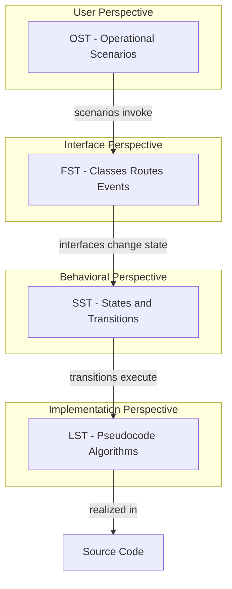

# PSP Templates Index — WeChat Cloned

| Field | Value |
|-------|-------|
| **Project** | WeChat Cloned |
| **Course Context** | SCD (Software Construction & Development) — PSP Chapter 11 Design Templates |
| **Author** | *[Student Name]* |
| **Date** | 2026-06-25 |
| **Version** | 1.0 |

---

## Overview

This folder contains four Personal Software Process (PSP) design specification templates, each filled with example content derived from the **WeChat Cloned** codebase: a Flask + SQLite + Socket.IO backend with a vanilla JavaScript frontend (`chat.js`, `connection.js`, `auth.js`).

The application (`APP_NAME = "WeChat Cloned"` in `backend/config.py`) provides registration/login, friend management, one-to-one and group real-time chat, attachments, and connection health monitoring.

---

## Template Inventory

| File | Template | Primary Focus |
|------|----------|---------------|
| [OST_Operational_Specification_Template.md](./OST_Operational_Specification_Template.md) | **OST** — Operational Specification | User-visible scenarios: actors, flows, postconditions, test cases |
| [FST_Functional_Specification_Template.md](./FST_Functional_Specification_Template.md) | **FST** — Functional Specification | External interfaces: routes, models, Socket.IO events, JS APIs |
| [SST_State_Specification_Template.md](./SST_State_Specification_Template.md) | **SST** — State Specification | State machines: sessions, message delivery, friends, groups, connection |
| [LST_Logic_Specification_Template.md](./LST_Logic_Specification_Template.md) | **LST** — Logic Specification | Internal algorithms in pseudocode for core procedures |

---

## Module Coverage Matrix

The filled examples span five core modules requested for this assignment:

| Module | OST | FST | SST | LST |
|--------|-----|-----|-----|-----|
| **Authentication** | Scenarios 1.1–1.3 | `User`, `login`, `register`, CSRF helpers | `UserSessionState` | Login rate limiting |
| **Messaging / Chat** | Scenarios 2.1–2.4 | REST + Socket.IO messaging API | `MessageDeliveryState` | `_create_message`, `_mark_conversation_read` |
| **Friends** | Scenarios 3.1–3.3 | Friends REST API, `are_friends` | `FriendRequestState` | `send_friend_request`, `add_friendship` |
| **Groups** | Scenarios 4.1–4.3 | Group routes, `Group`/`GroupMember` | `GroupMembershipState` | *(covered in FST; group create logic in `create_group` route)* |
| **Connection Status** | Scenarios 5.1–5.3 | `/health`, `ConnectionManager` | `BackendHealthState`, `SocketConnectionState`, `UserPresenceState` | `checkHealth`, `socket_connect` |

---

## How the Templates Relate

PSP design templates form a layered view of the same system from different perspectives:

### Reading Order (Recommended)

1. **OST** — Understand what users do and what the system must do in response (assignment demos, test plans).
2. **FST** — Map scenarios to concrete endpoints, models, and event contracts.
3. **SST** — Model lifecycle and concurrency (message `sent`→`delivered`→`seen`, online presence, offline recovery).
4. **LST** — Drill into algorithmic detail before implementing or modifying controllers.

### Cross-Template Traceability Example: Sending a Message

| Layer | Artifact |
|-------|----------|
| OST | Scenario 2.1 — Send Text Message (Socket.IO) |
| FST | `send_message` socket handler; `Message` model; `message:new` event |
| SST | `MessageDeliveryState`: `sent` → `delivered` on recipient connect |
| LST | `_create_message` pseudocode; `socket_connect` + `_mark_direct_messages_delivered` |

---

## Key Source Files Referenced

| Area | Path |
|------|------|
| Application entry | `backend/app.py` |
| Configuration | `backend/config.py` |
| Authentication | `backend/controllers/auth_controller.py` |
| Chat & groups | `backend/controllers/chat_controller.py` |
| Friends | `backend/controllers/friends_controller.py` |
| Shared helpers | `backend/controllers/helpers.py` |
| Models | `backend/models/user.py`, `message.py`, `group.py` |
| Chat UI logic | `frontend/static/js/chat.js` |
| Connection health | `frontend/static/js/connection.js` |
| Auth form UX | `frontend/static/js/auth.js` |
| Project overview | `README.md` |

---

## Technology Stack Summary

| Layer | Technology |
|-------|------------|
| Backend framework | Flask (blueprints, Jinja templates) |
| Realtime | Flask-SocketIO |
| Database | SQLite via SQLAlchemy ORM |
| Frontend | Vanilla JavaScript, CSS (`styles.css`) |
| Security | Werkzeug password hashes, session cookies, CSRF on mutating HTTP |
| Health | `GET /health` with `SELECT 1` database probe |

---

## Using These Templates for Future Work

Each file includes:

1. **PSP standard header** — project, module, author placeholder, date, version.
2. **Empty template structure** — labeled sections per PSP Chapter 11.
3. **Filled WeChat Cloned examples** — replace or extend for additional modules (e.g., profile, message reactions, desktop shell).

To add a new feature:

- Write OST scenarios first (user stories + exceptions).
- Define FST interfaces (new routes/events before coding).
- Identify SST states if the feature has lifecycle or protocol behavior.
- Document LST pseudocode for non-trivial algorithms.

---

## Assumptions and Notes

1. **Product name** is **WeChat Cloned** (not PulseChat); some frontend localStorage keys retain a `pulsechat-` prefix from earlier naming.
2. **Profile module** (`profile_controller.py`) is referenced in FST cross-cutting APIs but not expanded in all four templates to keep focus on the five core modules.
3. **Desktop mode** (`WECHAT_CLONED_DESKTOP=1`) alters upload URLs and data directories; operational flows are equivalent to web mode.
4. **Login rate limiting** uses in-memory storage; state resets on server restart (documented in LST).
5. Content reflects the codebase as of template creation date; regenerate FST route tables if new API endpoints are added.

---

## Document Change Log

| Version | Date | Changes |
|---------|------|---------|
| 1.0 | 2026-06-25 | Initial PSP templates with WeChat Cloned filled examples |
