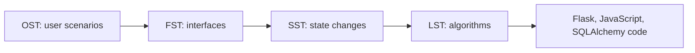

# PSP Documentation Map

This folder contains the PSP design templates for the WeChat-inspired chat clone. For the full project-level PSP mapping, see `../../../PSP_README.md`.

## Template to Project Map

| Template | File | Maps To |
|----------|------|---------|
| OST | `OST_Operational_Specification_Template.md` | User scenarios for authentication, messaging, friends, groups, and connection health |
| FST | `FST_Functional_Specification_Template.md` | Flask routes, Socket.IO events, model interfaces, helper methods, and frontend API contracts |
| SST | `SST_State_Specification_Template.md` | User session, message delivery, friend request, group membership, backend health, socket, and presence states |
| LST | `LST_Logic_Specification_Template.md` | Pseudocode for message creation, read receipts, login throttling, friend requests, health checks, and socket connect behavior |
| Index | `PSP_Templates_Index.md` | Summary, reading order, coverage matrix, and traceability notes |

## PSP Flow

Use the templates in this order when explaining or extending the project:

1. Start with OST to describe what the user does.
2. Use FST to identify the route, event, model, or method involved.
3. Use SST when the feature changes a lifecycle state.
4. Use LST to explain the internal algorithm before implementation.
